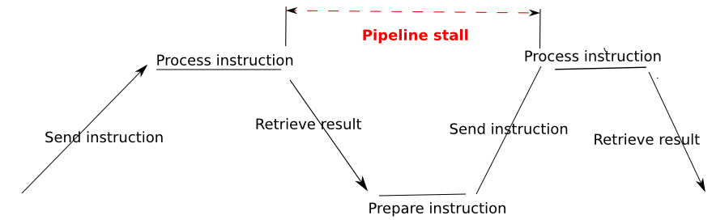

# cltorch

An OpenCL backend for [torch](http://torch.ch/).

## What is this?

It's a high-performance matrix library for OpenCL, that runs on your GPU(s) harnessing the massive computational capacity that they provide.

Most of the standard operations in [torch](https://github.com/torch/torch7) are supported.  If there are any missing that you need, please raise an issue.

## What's working

Most things really :-)  Detailed description at [ImplementedDetails.md](doc/ImplementedDetails.md).  Please don't hesitate to raise an issue for anything that's missing that you would like to see added.

## Installation

* First install torch distro, see [https://github.com/torch/distro](https://github.com/torch/distro).
  * Notes:
    * be sure to check you have a `~/torch/install/bin/torch-activate` file
    * make sure to run `source ~/torch/install/bin/torch-activate` before using torch, or else add this command to your `.bashrc` file
* Now, do:
```
git clone --recursive https://github.com/hughperkins/cltorch.git
cd cltorch
luarocks make rocks/cltorch-scm-1.rockspec
```
* If you get an error message about some files in EasyCL or clBLAS not existing, then do:
```
git submodule init
git submodule update
```
* If, during `git submodule update` command, it says something about `clBLAS/src` directory already exists, then do:
```
git submodule init
rmdir clMathLibraries/clBLAS/src
git submodule update
```
* Please make sure you run the self-tests first.  If any of them fail, please raise an issue.  They should all pass, reliably, every time.  To run the tests:
```
th -l cltorch -e 'cltorch.test()'
```
## Requests for additional operations etc

* Please raise an issue for any operations etc which you particularly need, or you feel are not working for some reason.
* (Ditto for any build errors)

## Unit tests / samples

Simply run:
```
th -l cltorch -e 'cltorch.test()'
```

These tests should systematically run clean.  They do on the systems I've tested against.  If they don't, it's a bug.  Please raise an issue, including your operating system, graphics card, 32-bit/64-bit, all full logs, and anything else you can think of.  Also output of `th -l cltorch -e 'cltorch.about()'` please.

## cltorch-specific features

The following features are either cltorch-specific, or do not exist in cutorch:

|feature|in torch?|in cutorch?|
|---|---|---|
| apply/map/map2 | Yes |  |
| csub, neg |  |  |
| optimization tools | | |
| point tensors | | |
| custom user kernels | Not applicable | |

### apply/map/map2

`apply`, `map`, `map2` exist in torch, but how to make them work on the GPU?  Cannot just pass in lua functions, at least not a the moment.

What we do is, you can provide opencl code directly to apply, map and map2, as a string expression.  This will run on the gpu, at full speed.  Examples, for `x`, `y`, `z` being identically sized `torch.ClTensor`s:
```
x:apply("x = sqrt(x + 3.5)")
x:map(y, "x = 1000 * x + y * 10")
x:map2(y, z, "x = sqrt(1000 * x + y * 10 + z * z)")
```
* note that the variables in the OpenCL string expression must be named as above, ie `x`, `y`, `z`.  For convenience, these were named the same as the tensors in the example.  If the tensors have different names, please continue to use `x`, `y`, `z` in the expressions, eg:
```
a:apply("x = sqrt(x + 3.5)")
a:map(b, "x = 1000 * x + y * 10")
a:map2(b, c, "x = sqrt(1000 * x + y * 10 + z * z)")
```

### csub, neg

In-place versions of `-`, to avoid buffer copying and/or creating new buffers:
```
c:csub(d) -- subtracts d from c, element-wise
          -- similar to 'c - d'
          -- but stores results into c
a:neg()   -- similar to '- a'
          -- but stores results into a
```

### Optimization tools

Following tools are available to aid with optimization:

|Method|Description|
|------|---------|
|`cltorch.setProfiling(1)` |  turn on opencl kernel profiling |
|`cltorch.dumpProfiling()` | dump opencl kernel profiling timings since last call|
|`cltorch.setEnableTiming(1)`  | enable collection of cumulative wall-clock timings for cltorch code |
|`cltorch.dumpTimings()`  | dump cumulative wall-clock timings for cltorch code |
|`cltorch.setTrace(1)` | print all gpu buffer allocations and copies between host/gpu |

#### OpenCL Profiling

OpenCL natively provides facilities to measure the execution time of kernels, without needing to call `cltorch.finish()` or similar first, using [clGetEventProfilingInfo](https://www.khronos.org/registry/cl/sdk/1.0/docs/man/xhtml/clGetEventProfilingInfo.html).  In cltorch, you dont need to know how this works ;-)  Simply call, at the start of your code:

```
cltorch.setProfiling(1)
```
Then, after running the piece of code under scrutiny, simply call:
```
cltorch.dumpProfiling()
```
Timings are cumulative across multiple calls to the same kernel.

#### DumpTimings

This uses the wall-clock times to measure the elapsed time in different sections of cltorch code.  The way it works is, each time the cltorch c++ code calls `StatefulTimer::instance()->timeCheck("some status")`, the wall-clock time since the last call to `->timeCheck()` will be added to the cumulative time for `some status`.  You can pass any status as a string.  Then, after running the piece of code under the scrutiny, in your Lua program, simply call `cltorch.dumpTimings()` to dump these cumulative timings.

Update: please first call `cltorch.setEnableTiming(true)` to enable collection of timing information.  This is global across all devices.

#### GPU buffer allocations and copies

You can log all GPU buffer allocations, copies to host, and copies to GPU device.  Simply call:
```
cltorch.setTrace(1)
```
Any buffer allocations, and copies between host and device, will now be printed to stdout.

### Point tensors: reduce pipeline stalls

Point tensors help to eliminate pipeline stalls associated with ReduceAll operations such as `sometensor:sum()`.  Why does `:sum()` cause pipeline stalls, and how do point tensors eliminate this source of stalls?

If we send a single instruction (a kernel) to the gpu, there will be some latency whilst the instruction arrives at the gpu, and starts running, and some more latency after the calculations have finished, whilst the results are retrieved back from the GPU.  Maybe we send:

```
a:add(1)
```
We can draw a picture of what happens.  Time is towards the right.  GPU is at the top.  CPU at the bottom:


But we can send lots of instructions, without waiting for the earlier ones to finish. Maybe we do:
```
a:add(b)
a:mul(3)
b:mul(a)
c:add(a)
```
This might look like this, we dont have to wait for the previous instruction to finish:


But now imagine what happens if we process the following instruction:
```
a:div(a:sum())
```
- a:sum() is going to take the sum of all the elements in a
- a:div(a:sum()) is then going to divide all the elements of a by this sum
- it looks innocent enough
- but notice that we cannot send the `a:div` instruction until the `a:sum()` results have come back
- so we have to wait for `a:sum()` to finish processing, and for the results to come back, before we can continue

Looks like this:


*Classic reduceall => Massive pipeline stall*

*Point tensors eliminate this*.  When we do the reduceall, the `:sum()` operation, we keep the results on the gpu, like this:
```
c = torch.Tensor(20,30):uniform():cl() -- create a tensor on the GPU
res = torch.ClTensor()                 -- create a point tensor on the GPU
res:sum(c)                             -- sum c, and keep the result in res, on the GPU
```
c is a point tensor.  It has zero dimensions.  It contains a single scalar float.  It stays on the GPU.  We can feed it into other operations as follows:
```
c:div(res)  -- divide c by res
```
We can send this instruction straight away, even before the first `:sum(c)` instruction has arrived at the GPU.  So, no more stall.

By the way, it's possible to print the value of a point tensor, by printing it, or calling the `:s()` operator.  Normally you wouldnt do this except during debugging though, since obviously this will need to wait for the gpu operation to finish, and for the data to come all the way back from the GPU :-)

### Custom user kernels

Custom user kernels let you run OpenCL code directly from Torch Lua!  Of course, you can already do this with `apply`, `map`, and `map2`, see above.  But now you can provide whole kernel functions, and other functions, and pass ClTensors into these kernels!

Example of how to use:

```
require 'cltorch'

k = torch.ClKernel({input={nElements='int', input='torch.ClTensor'},output={output='torch.ClTensor'},src=[[
   int linearId = get_global_id(0);
   if(linearId < nElements) {
     output_data[linearId] = input_data[linearId] + 3.0f;
   }
]]})
print('k', k)
k:print()

x = torch.ClTensor({3,5,2})
y = torch.ClTensor({6,4,2})
print('x before\n', x)
print('y before\n', y)

k:run({nElements=3, input=x, output=y})

print('y after\n', y)
```

Output from this example:
```
Using Intel platform: Intel Gen OCL Driver
Using device: Intel(R) HD Graphics BroadWell U-Processor GT2
k	torch.ClKernel
Original source
===============
   int linearId = get_global_id(0);
   if(linearId < nElements) {
     output_data[linearId] = input_data[linearId] + 3.0f;
   }


Generated source
================
typedef struct THClTensorInfoCl {
  unsigned int sizes[25];
  unsigned int strides[25];
  int offset;
  int dims;
} TensorInfoCl;


kernel void user_kernel(
    global struct THClTensorInfoCl *input_info, global float * input_data,
    int nElements,
    global struct THClTensorInfoCl *output_info, global float * output_data
) {
   int linearId = get_global_id(0);
   if(linearId < nElements) {
     output_data[linearId] = input_data[linearId] + 3.0f;
   }

}

x before
	 3
 5
 2
[torch.ClTensor of size 3]

y before
	 6
 4
 2
[torch.ClTensor of size 3]

y after
	 6
 8
 5
[torch.ClTensor of size 3]

```

If you want, you can specify the number of workgroups, and the workgroupsize, yourself:
```
k:run({nElements=3, input=x, output=y}, {numWorkgroups=10, workgroupSize=32}
```

## Co-existence with cutorch

* It is possible to load cutorch and cltorch at the same time, if you wish
* If you do this, please load cutorch first, and then load cltorch second
* If you get errors about #1 argument to copy should be tensor, but is userdata, then please double-check that cutorch is `required`d before cltorch (they each monkey-patch torch, but since cutorch was written first, it assumes there is no monkey-patch conflict)

## Third-party libraries

cltorch uses the following libraries. These are automatically built as part of cltorch build process:
* [clBLAS](https://github.com/clMathLibraries/clBLAS) - provides GPU-based matrix operations, such as multiplication
* [EasyCL](https://github.com/hughperkins/EasyCL) - provides an abstraction layer over the low-level OpenCL API
* [clew](https://github.com/martijnberger/clew) - similar to glew, means that cltorch can be loaded without any OpenCL library/runtime being present

At runtime, if you want to call any of the cltorch methods, you will also need:
* OpenCL-compatible GPU
* OpenCL library/driver (normally provided by the GPU vendor)

## Guidelines for contributors

You might or might not find [ContributorGuidelines.md](doc/ContributorGuidelines.md) useful.  Not required reading, but it is there if you want to see my own thoughts and ideas on how I am currently approaching cltorch development, and cutorch-porting.

Also, some more technical guidelines on porting, in the [clnn](https://github.com/hughperkins/clnn) repository, at [porting-guidelines.md](https://github.com/hughperkins/clnn/blob/master/doc/porting-guidelines.md).

## Related projects

There is an OpenCL backend for `nn` and `nngraph` at [clnn](https://github.com/hughperkins/clnn).

## Recent changes

* 23rd July:
  * Fixed memory leak on Intel HD Graphics
* 22th July:
  * Performance improvement:
    * All per-element operations are around 2-5 faster on NVIDIA and AMD now
    * In the specific, this means that times for Karpathy's [char-rnn](http://github.com/karpathy/char-rnn) are around 2-3 times faster on NVIDIA and AMD cards, compared to before
  * [colesbury](https://github.com/colesbury)'s pull request [#176](https://github.com/torch/cutorch/pull/176) ported to cltorch, 'Allow CudaTensors as indices'
  * [andresy](https://github.com/andresy)'s pull request [#203](https://github.com/torch/cutorch/pull/203) ported to cltorch, 'expose retain and free for CudaStorage/CudaTensor'
* 19th July:
  * Upgrade EasyCL version
  * Need to explicitly enable timing now (just in case impacts performance)
  * DumpTimings now shows count of number of calls, as well as timings
* 18th July:
  * Added custom user kernels
* 16th July:
  * Did some cleaning:
    * source code now all in `src` directory, to keep the front page on github clean
    * moved a bunch of stuff from this page to other pages, ie older changes, and list of what works
    * 20x speed boost for Apply kernel, and char-rnn, on Intel HD5500 GPU
* 15th July:
  * can pass point ClTensor now also to `:lt()`, `:gt()`, `:le()`, `:ge()`, `:eq()`, `:ne()`
  * added profiling:
    * `cltorch.setProfiling(1)` to enable (has a performance hit obviously, whilst enabled)
    * `cltorch.dumpProfiling()` to dump timings since last dump
      * timings are cumulative over kernel filename/kernelname combination
* 14th July:
  * created point tensors:
    * `:sum()` can return a point tensor, which stays on the GPU, eliminating gpu pipeline stall, see presentation above
    * `add()`, `csub()`, `mul` and `div` can all accept a point tensor in place of their scalar argument
  * `:prod()` can return a point tensor too now, as can `:max()`, `:min()`, `:all()`, and `:any()`
  * can pass point ClTensor also to `:fill()` now
* 13th July:
  * possible to use tensors without `:setDevice()` to same device as them first.  Tested with `:sum()`, `:sum(1)`, and `:sum(2)` for now
* 12th July:
  * add `cltorch.about()`, to provide build information
* 10th July:
  * added cmin, cmax, for tensors and scalars (as per https://github.com/torch/cutorch/pull/198/files )
* 5th July:
  * fixed some Mac build/load issues, so builds/loads on Mac now (thank you to mlajtos, szagouyko, centime, luo123n, and pdhvip for their enormous help with fixing this :-) )
  * getDeviceProperties and so on now only show GPU and APU devices, ignores pure CPU devices (which pure CPU devices are not supported by cltorch at this time)
  * added `cltorch.test()`, which runs unit tests
* 4th July:
  * `torch.save` and `torch.load` implemented

[OlderChanges.md](doc/OlderChanges.md)

