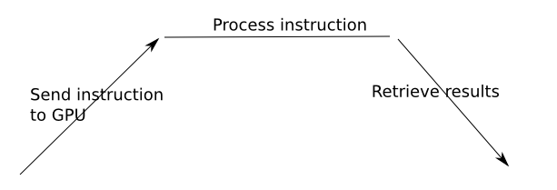
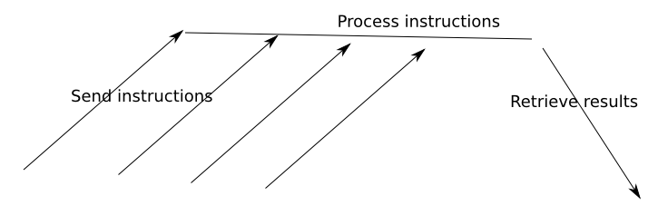

# cltorch

An OpenCL backend for [torch](http://torch.ch/).

## What is this?

It's a high-performance matrix library for OpenCL, that runs on your GPU(s) harnessing the massive computational capacity that they provide.

Most of the standard operations in [torch](https://github.com/torch/torch7) are supported.  If there are any missing that you need, please raise an issue.

## What's working

Most things really :-)  Detailed description at [ImplementedDetails.md](doc/ImplementedDetails.md).  Please don't hesitate to raise an issue for anything that's missing that you would like to see added.

## Installation

* First install torch distro, see [https://github.com/torch/distro](https://github.com/torch/distro).
* Now, do:
```
git clone --recursive https://github.com/hughperkins/cltorch.git
cd cltorch
luarocks make rocks/cltorch-scm-1.rockspec
```
* If you get an error message about some files in EasyCL or clBLAS not existing, then do:
```
git submodule init
git submodule update
```
* If, during `git submodule update` command, it says something about `clBLAS/src` directory already exists, then do:
```
git submodule init
rmdir clMathLibraries/clBLAS/src
git submodule update
```
* Please make sure you run the self-tests first.  If any of them fail, please raise an issue.  They should all pass, reliably, every time.  To run the tests:
```
th -l cltorch -e 'cltorch.test()'
```
## Requests for additional operations etc

* Please raise an issue for any operations etc which you particularly need, or you feel are not working for some reason.
* (Ditto for any build errors)

## Unit tests / samples

Simply run:
```
th -l cltorch -e 'cltorch.test()'
```

These tests should systematically run clean.  They do on the systems I've tested against.  If they don't, it's a bug.  Please raise an issue, including your operating system, graphics card, 32-bit/64-bit, all full logs, and anything else you can think of.  Also output of `th -l cltorch -e 'cltorch.about()'` please.

## cltorch-specific features

### apply/map/map2

You can provide opencl code to apply, map and map2, which will run on the gpu, at full speed.  Just provide the opencl as a string to apply, map or map2.  Examples, for `c`, `d`, `e` are identically sized `ClTensor`s:
```
c:apply("x = sqrt(x + 3.5)")
c:map(d, "x = 1000 * x + y * 10")
c:map2(d, e, "x = sqrt(1000 * x + y * 10 + z * z)")
```

### Optimization tools

Following tools are available to aid with optimization:

|Method|Description|
|------|---------|
|`cltorch.setProfiling(1)` |  turn on opencl kernel profiling |
|`cltorch.dumpProfiling()` | dump opencl kernel profiling timings since last call|
|`cltorch.dumpTimings()`  | dump cumulative wall-clock timings for cltorch code |
|`cltorch.setTrace(1)` | print all gpu buffer allocations and copies between host/gpu |

### Point tensors: reduce pipeline stalls

Point tensors help to eliminate pipeline stalls associated with ReduceAll operations such as `sometensor:sum()`.  Why does `:sum()` cause pipeline stalls, and how do point tensors eliminate this source of stalls?

If we send a single instruction (a kernel) to the gpu, there will be some latency whilst the instruction arrives at the gpu, and starts running, and some more latency after the calculations have finished, whilst the results are retrieved back from the GPU.  Maybe we send:

```
a:add(1)
```
We can draw a picture of what happens.  Time is towards the right.  GPU is at the top.  CPU at the bottom:



But we can send lots of instructions, without waiting for the earlier ones to finish. Maybe we do:
```
a:add(b)
a:mul(3)
b:mul(a)
c:add(a)
```
This might look like this, we dont have to wait for the previous instruction to finish:


But now imagine what happens if we process the following instruction:
```
a:div(a:sum())
```
- a:sum() is going to take the sum of all the elements in a
- a:div(a:sum()) is then going to divide all the elements of a by this sum
- it looks innocent enough
- but notice that we cannot send the `a:div` instruction until the `a:sum()` results have come back
- so we have to wait for `a:sum()` to finish processing, and for the results to come back, before we can continue

Looks like this:


*Classic reduceall => Massive pipeline stall*

*Point tensors eliminate this*.  When we do the reduceall, the `:sum()` operation, we keep the results on the gpu, like this:
```
c = torch.Tensor(20,30):uniform():cl() -- create a tensor on the GPU
res = torch.ClTensor()                 -- create a point tensor on the GPU
res:sum(c)                             -- sum c, and keep the result in res, on the GPU
```
c is a point tensor.  It has zero dimensions.  It contains a single scalar float.  It stays on the GPU.  We can feed it into other operations as follows:
```
c:div(res)  -- divide c by res
```
We can send this instruction straight away, even before the first `:sum(c)` instruction has arrived at the GPU.  So, no more stall.

By the way, it's possible to print the value of a point tensor, by printing it, or calling the `:s()` operator.  Normally you wouldnt do this except during debugging though, since obviously this will need to wait for the gpu operation to finish, and for the data to come all the way back from the GPU :-)

## Co-existence with cutorch

* It is possible to load cutorch and cltorch at the same time, if you wish
* If you do this, please load cutorch first, and then load cltorch second
* If you get errors about #1 argument to copy should be tensor, but is userdata, then please double-check that cutorch is `required`d before cltorch (they each monkey-patch torch, but since cutorch was written first, it assumes there is no monkey-patch conflict)

## Third-party libraries

cltorch uses the following libraries. These are automatically built as part of cltorch build process:
* [clBLAS](https://github.com/clMathLibraries/clBLAS) - provides GPU-based matrix operations, such as multiplication
* [EasyCL](https://github.com/hughperkins/EasyCL) - provides an abstraction layer over the low-level OpenCL API
* [clew](https://github.com/martijnberger/clew) - similar to glew, means that cltorch can be loaded without any OpenCL library/runtime being present

At runtime, if you want to call any of the cltorch methods, you will also need:
* OpenCL-compatible GPU
* OpenCL library/driver (normally provided by the GPU vendor)

## Guidelines for contributors

You might or might not find [ContributorGuidelines.md](doc/ContributorGuidelines.md) useful.  Not required reading, but it is there if you want to see my own thoughts and ideas on how I am currently approaching cltorch development, and cutorch-porting.

Also, some more technical guidelines on porting, in the [clnn](https://github.com/hughperkins/clnn) repository, at [porting-guidelines.md](https://github.com/hughperkins/clnn/blob/master/doc/porting-guidelines.md).

## Related projects

There is an OpenCL backend for `nn` and `nngraph` at [clnn](https://github.com/hughperkins/clnn).

## Recent changes

* 15th July:
  * can pass point ClTensor now also to `:lt()`, `:gt()`, `:le()`, `:ge()`, `:eq()`, `:ne()`
  * added profiling:
    * `cltorch.setProfiling(1)` to enable (has a performance hit obviously, whilst enabled)
    * `cltorch.dumpProfiling()` to dump timings since last dump
      * timings are cumulative over kernel filename/kernelname combination
* 14th July:
  * created point tensors:
    * `:sum()` can return a point tensor, which stays on the GPU, eliminating gpu pipeline stall, see presentation above
    * `add()`, `csub()`, `mul` and `div` can all accept a point tensor in place of their scalar argument
  * `:prod()` can return a point tensor too now, as can `:max()`, `:min()`, `:all()`, and `:any()`
  * can pass point ClTensor also to `:fill()` now
* 13th July:
  * possible to use tensors without `:setDevice()` to same device as them first.  Tested with `:sum()`, `:sum(1)`, and `:sum(2)` for now
* 12th July:
  * add `cltorch.about()`, to provide build information
* 10th July:
  * added cmin, cmax, for tensors and scalars (as per https://github.com/torch/cutorch/pull/198/files )
* 5th July:
  * fixed some Mac build/load issues, so builds/loads on Mac now (thank you to mlajtos, szagouyko, centime, luo123n, and pdhvip for their enormous help with fixing this :-) )
  * getDeviceProperties and so on now only show GPU and APU devices, ignores pure CPU devices (which pure CPU devices are not supported by cltorch at this time)
  * added `cltorch.test()`, which runs unit tests
* 4th July:
  * `torch.save` and `torch.load` implemented
* For older changes, please see [OlderChanges.md](doc/OlderChanges.md)

